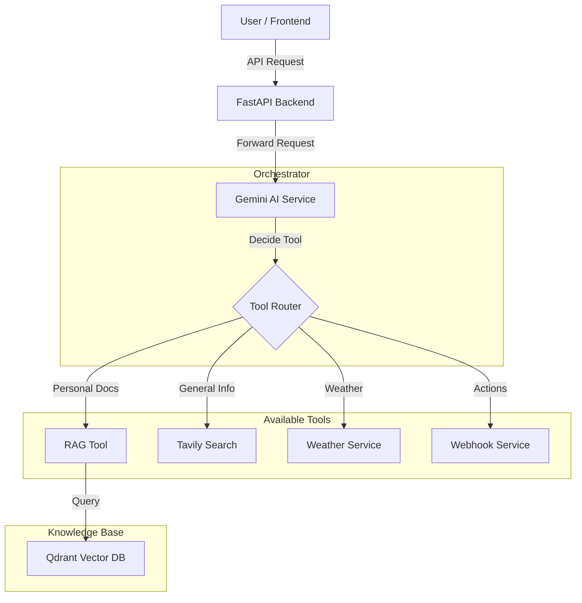

# AI Agent Backend with RAG & Gemini SDK Tool Calling

Welcome to the **AI Agent Backend with RAG & Gemini SDK Tool Calling**! This project is a smart assistant that is orchestrated by Gemini LLM and decide which tool to use to answer your Queries. Whether RAG for documents based query, web search, weather api or webhook call.

Think of it as a **super-search engine** for your own files, combined with a helpful chatbot.

---

## 🏗️ System Architecture

Here is a high-level view of how the system works:



### Visual Architecture

```mermaid
graph TD
    User[User / Frontend] -->|API Requests| API[FastAPI Backend]
    
    subgraph "Core Services"
        API -->|Chat| Gemini[Gemini AI Service]
        API -->|Upload/Search| RAG[RAG Service]
    end
    
    subgraph "Knowledge Base"
        RAG -->|Read & Process| Parser[PDF Parser (PDFPlumber +LlamaParse)]
        RAG -->|Store & Retrieve| VectorDB[Qdrant Vector DB]
    end
    
    subgraph "External Tools"
        Gemini -->|Search Web| Tavily[Tavily Search]
        Gemini -->|Get Weather| Weather[Weather Service]
        Gemini -->|Trigger Actions| Webhook[Webhook Service]
    end
```

```text
+--------+      +-----------+      +---------------------+
|  User  | ---> |  FastAPI  | ---> |  Gemini AI Service  |
+--------+      +-----------+      +----------+----------+
                                              |
                                     (Decides which tool)
                                              |
        +--------------+----------------------+------------------+
        |              |                      |                  |
   +---------+   +------------+        +-------------+    +-------------+
   | RAG Tool|   | Web Search |        | Weather API |    |   Webhook   |
   +----+----+   +------------+        +-------------+    +-------------+
        |
  +-----+-----+
  | Qdrant DB |
  +-----------+
```

### How it works (The "Simplified" Explanation):
1.  **You send a message** to the system.
2.  **The Orchestrator (Gemini AI)** receives your message and thinks: *"Do I know this answer, or do I need a tool?"*
3.  **Tool Selection**:
    *   If you ask about your files => Calls **RAG Tool** (which searches **Qdrant**).
    *   If you ask about the weather => Calls **Weather Tool**.
    *   If you ask "Who won the game yesterday?" => Calls **Tavily (Web Search)**.
4.  **The Answer**: Gemini combines the tool's data with its own intelligence to give you the final response.

---

## ✨ Features

-   **Chat with your Documents**: Upload PDFs and ask questions about them.
-   **Web Search Capable**: If the answer isn't in your files, it can search the web.
-   **Smart Actions**: Can check the weather or trigger external webhooks.
-   **Fast & Reliable**: Built with modern, high-performance technologies.

---

## 🚀 Getting Started

Follow these simple steps to get the project running on your computer.

### Prerequisites
Before you start, make sure you have:
1.  **Python** installed (version 3.10 or higher recommended). [Download Python](https://www.python.org/downloads/)
2.  **Git** installed. [Download Git](https://git-scm.com/downloads)

### Installation

1.  **Clone the Repository** (Download the code)
    Open your terminal or command prompt and run:
    ```bash
    git clone https://github.com/asadwebosmotic/RAG-GEMINI-SDK
    cd RAG-GEMINI-SDK
    ```

2.  **Create a Virtual Environment** (A safe space for the project)
    ```bash
    # Windows
    python -m venv venv
    .\venv\Scripts\activate

    # Mac/Linux
    python3 -m venv venv
    source venv/bin/activate
    ```

3.  **Install Dependencies** (Get the required software libraries)
    ```bash
    pip install -r requirements.txt
    ```

---

## ⚙️ Configuration

You need to tell the system your secret passwords (API Keys) for it to work.

1.  Find the file named `.env.example` in the project folder.
2.  Make a copy of it and rename it to `.env`.
3.  Open `.env` with a text editor (Notepad, VS Code, etc.) and fill in your keys:

    ```ini
    # Example .env file content
    GOOGLE_API_KEY=your_gemini_api_key_here
    QDRANT_API_KEY=your_qdrant_key_here
    QDRANT_URL=your_qdrant_url_here
    TAVILY_API_KEY=your_tavily_key_here
    LLAMA_CLOUD_API_KEY=your_llama_parse_key_here
    WEBHOOK_URL=your_webhook_url_here
    WEATHER_API_KEY=your_weather_api_key_here
    ```

---

## ▶️ Running the Application

Once everything is set up, start the server:

```bash
python main.py
```

You should see a message saying: `Uvicorn running on http://0.0.0.0:8000`.

### How to Use
1.  Open your web browser and go to: **[http://localhost:8000/docs](http://localhost:8000/docs)**
2.  You will see a "Swagger UI" dashboard. This is a control panel where you can test the features.
    -   **POST /v1/pdf/upload**: Use this to upload PDF files.
    -   **POST /v1/chat**: Use this to send messages to the bot.
    -   **GET /v1/health**: Check if the system is healthy.

---

## 📁 Project Structure (For Developers)

Here is the detailed organization of the project files:

```text
RAG-GEMINI-SDK/
├── api/                        # API Layout
│   ├── routes/                 # Endpoint definitions
│   │   ├── chat.py             # Chatbot endpoints
│   │   ├── health.py           # Health check endpoint
│   │   └── pdf.py              # PDF management endpoints
│   ├── exceptions.py           # Custom error handling
│   └── __init__.py
├── RAG/                        # Retrieval-Augmented Generation Logic
│   ├── embedding_and_store.py  # Qdrant vector database operations
│   ├── parsing_and_chunking.py # PDF parsing (LlamaParse) & text chunking
│   └── __init__.py
├── services/                   # Business Logic Services
│   ├── gemini_service.py       # Google Gemini AI integration
│   ├── rag_service.py          # RAG orchestration
│   ├── tavily_service.py       # Web search integration
│   ├── weather_service.py      # Weather API tools
│   ├── webhook_service.py      # External webhook triggers
│   └── __init__.py
├── tools/                      # Tool Definitions for AI Agents
│   ├── gemini_tools.py         # Function definitions for Gemini
│   └── __init__.py
├── src/                        # Utilities
│   ├── utils.py                # Helper functions
│   └── __init__.py
├── .env                        # Environment variables (API Keys)
├── .env.example                # Example environment file
├── config.py                   # Global configuration loading
├── main.py                     # Application Entry Point
└── requirements.txt            # Python dependencies
```
